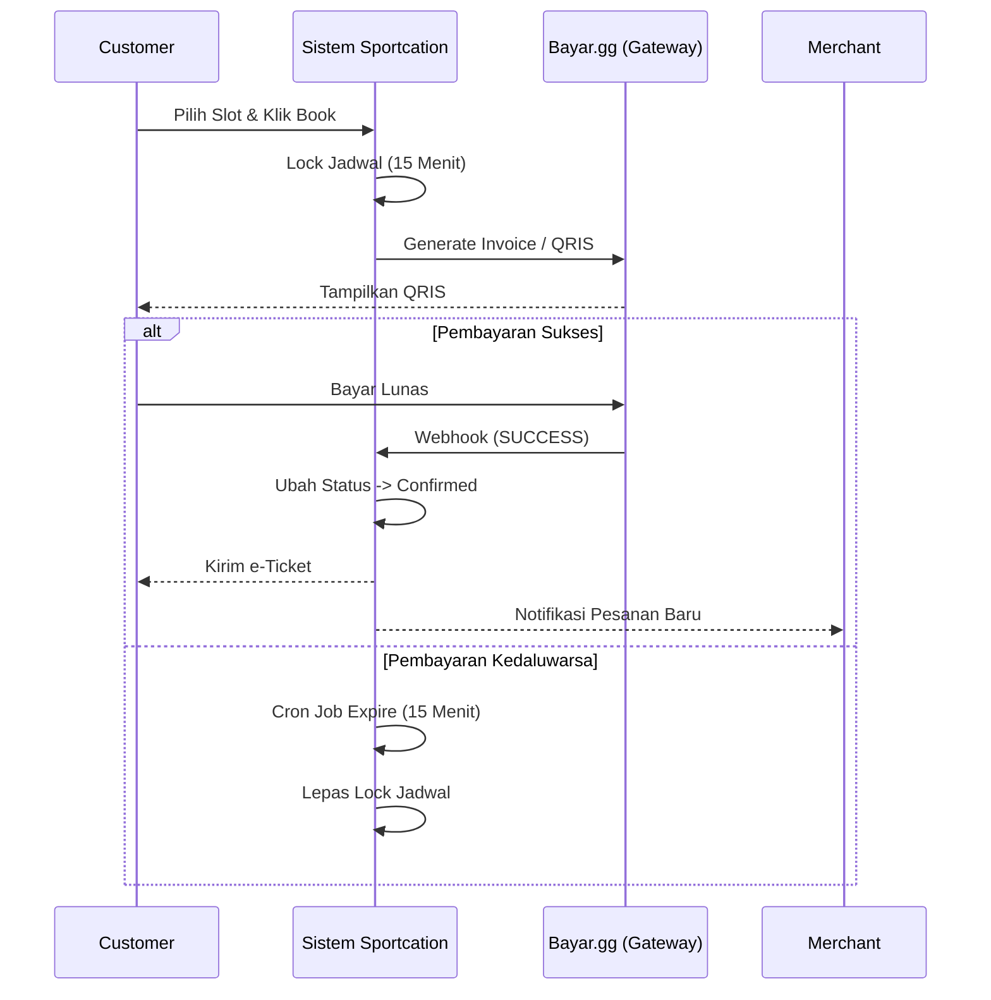

# 🏢 SOP Operasional & Prosedural Sportcation

Dokumen ini adalah **Standard Operating Procedure (SOP)** komprehensif yang mengatur alur bisnis, Service Level Agreement (SLA), dan tanggung jawab prosedural di dalam ekosistem Sportcation. Dokumen ini dirancang khusus untuk memenuhi standar operasional startup digital modern.

---

## 👥 1. Struktur Peran & Tanggung Jawab (Roles)

| Role | Kode Dashboard | Fokus Utama | SLA / Metrik Kunci |
| :--- | :--- | :--- | :--- |
| **Manajemen** | Super Admin | Keputusan strategis, pengaturan platform fee, dan pantauan performa GMV. | Laporan Bulanan |
| **Admin Ops** | Ops | Verifikasi Merchant, moderasi listing (resell/auction), kontrol penipuan. | 1x24 Jam Kerja |
| **Admin Finance**| Finance | Eksekusi pencairan dana (withdrawals), refund manual, rekonsiliasi kas. | Cut-off harian 14:00 |
| **Admin CS** | CS | Penanganan komplain pelanggan, mediasi sengketa transaksi. | Respons < 2 Jam |
| **Tim IT** | Developer | Incident response, uptime server (Vercel), hotfix, database maintenance. | Uptime 99.9% |

---

## 🛠️ 2. Prosedur Inti Operasional

### 2.1 Verifikasi & Onboarding Merchant (Admin Ops)
> [!IMPORTANT]
> Merchant tidak dapat menerima pesanan sebelum status entitas diverifikasi.

1. **Jadwal Verifikasi**: Pengecekan *dashboard* dilakukan secara batch dua kali sehari: **09:00 WIB** dan **14:00 WIB**.
2. **Validasi Data**:
   - Bandingkan kesesuaian dokumen Legalitas (KTP/NPWP) dengan data yang didaftarkan.
   - Verifikasi konsistensi nama pemilik dengan profil entitas.
3. **Eksekusi**:
   - Jika valid: Tekan **`Approve`** (Otomatis mengirim email *Welcome*).
   - Jika cacat/buram: Tekan **`Reject`** (Wajib menyertakan *reasoning* penolakan yang jelas).

### 2.2 Arus Transaksi & Pembayaran Otomatis
Sistem Sportcation menggunakan automasi penuh untuk transaksi.

### 2.3 Pencairan Dana / Withdrawal (Admin Finance)
> [!CAUTION]
> Admin Finance wajib menekan tombol **Mark as Processed** setelah transfer bank berhasil agar ledger sistem tersinkronisasi. Jangan menekan tombol ini jika transfer belum dilakukan!

1. **Cut-Off Operasional**: Pukul **14:00 WIB** setiap hari kerja.
2. **Rekapitulasi**: Admin Finance mengekspor data *Pending Withdrawals* menjadi CSV.
3. **Eksekusi Transfer**: Lakukan *Bulk Transfer* ke rekening mitra via *Corporate Banking* (contoh: KlikBCA Bisnis / MCM).
4. **Finalisasi**: Setelah bank memvalidasi transfer berhasil, Finance mengonfirmasi mutasi pada *Dashboard Sportcation*.

### 2.4 Mediasi Sengketa & Refund (Admin CS & Finance)
Jika *Customer* melapor lapangan tutup atau tidak bisa digunakan (maksimal H+1):
1. **Hold Dana**: CS mencari kode pesanan (`BKG-XXX`) dan menandai transaksi sebagai **`DISPUTED`**.
2. **Investigasi**: CS mengonfirmasi ke pihak lapangan (Merchant).
3. **Resolusi**:
   - Jika Merchant salah: CS me-request *Refund*, Finance melakukan transfer *refund* 100% ke Customer, Ops memberikan **Sanksi SP1** ke Merchant.
   - Jika Customer salah: Transaksi diselesaikan (`Completed`), dana diteruskan ke hak Merchant.

---

## 🚨 3. Prosedur Eskalasi Bencana IT (Incident Response)

> [!WARNING]
> Prosedur ini mengesampingkan rilis fitur baru demi menyelamatkan transaksi bisnis.

1. **Triage Kritis (Blocker P1)**: 
   - Gejala: Seluruh pengguna tidak bisa *login* atau fitur pembayaran mati 100%.
   - Target Respon Tim IT: **< 15 Menit**.
2. **Prosedur Rollback**:
   - Jika sumber *error* tidak ditemukan/diperbaiki dalam waktu 15 menit pengerjaan, Lead IT **wajib** melakukan perintah `git revert` ke versi stabil (hari sebelumnya).
   - Eksekusi *Redeploy* instan di Vercel.
3. **Manajemen Komunikasi**: 
   - Jika *downtime* menyentuh 30 menit, operasional menaikkan *Maintenance Banner*.
   - H+1 pasca insiden, Tim IT merilis dokumen *Post-Mortem* (Root Cause Analysis).
